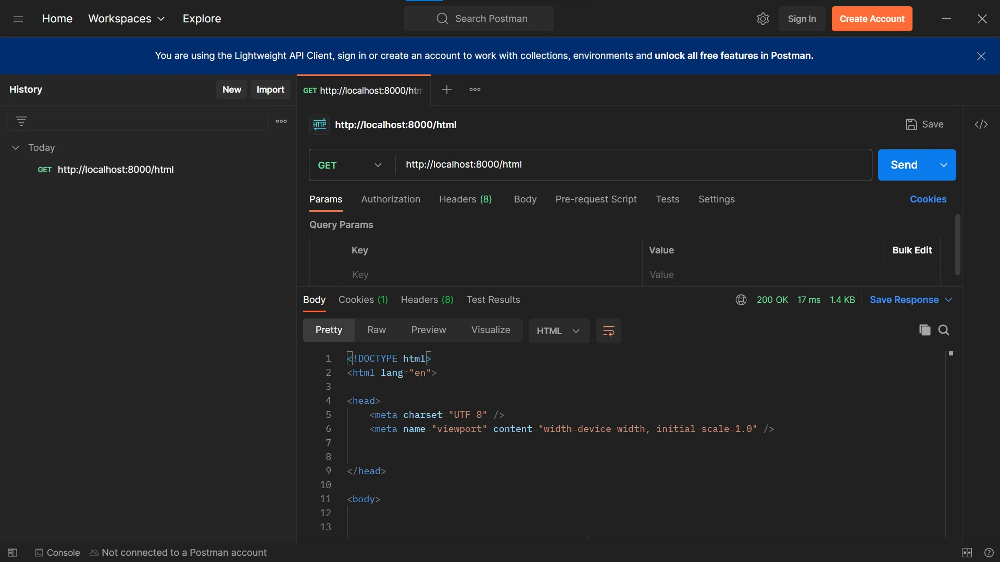
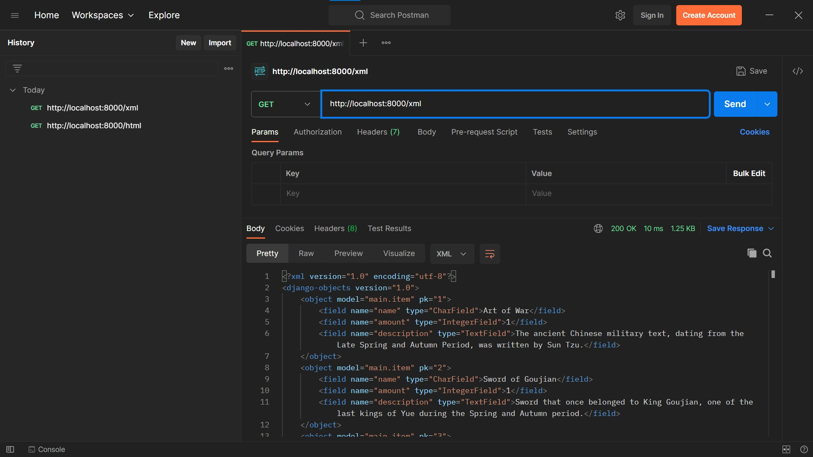
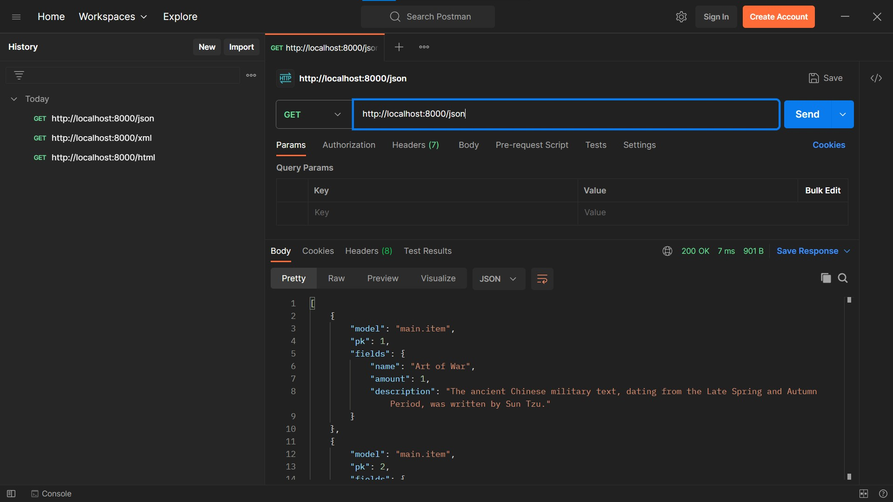
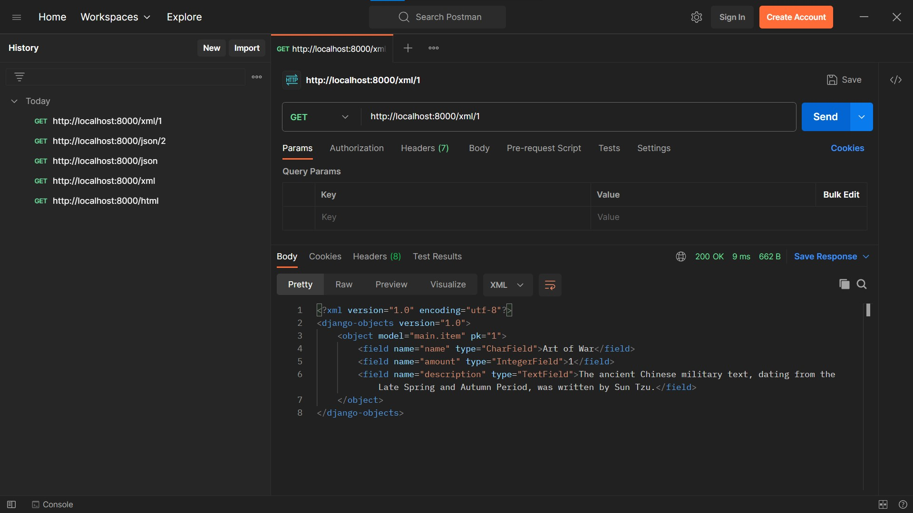
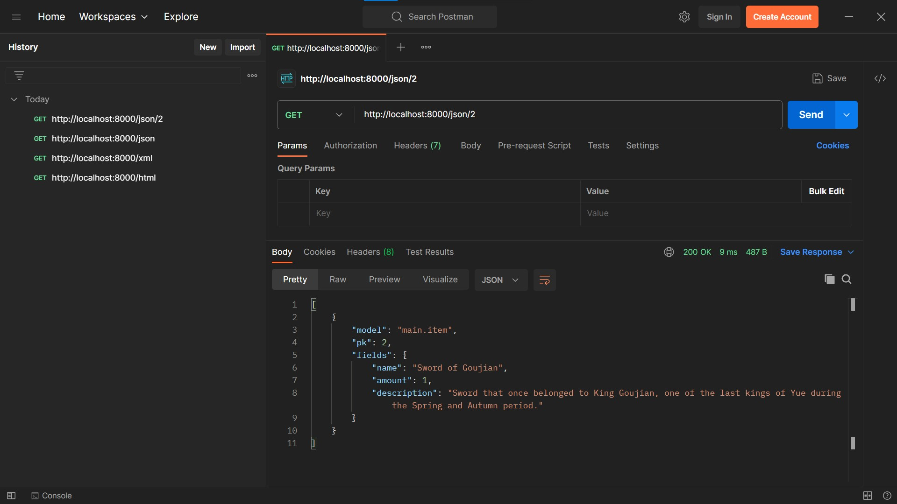
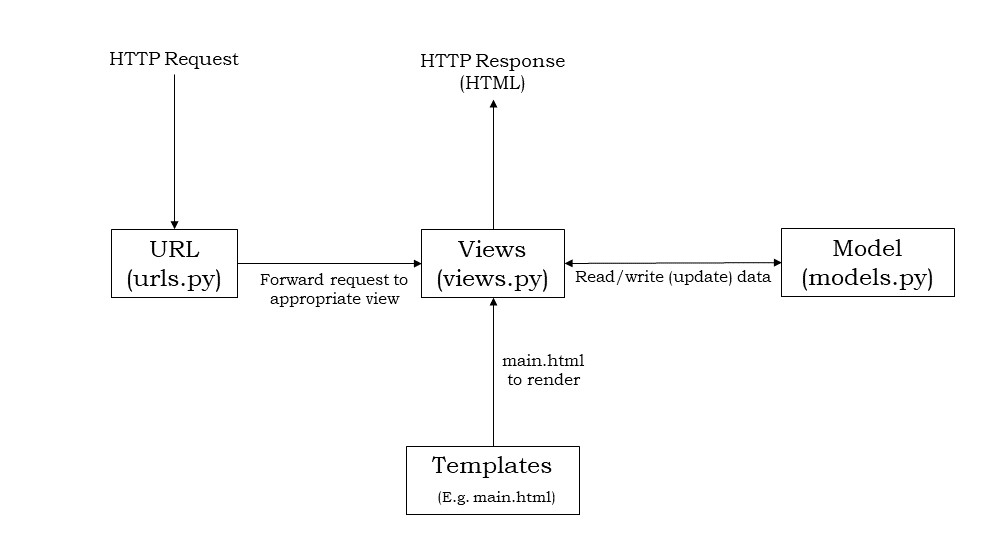

Link Adaptable:
https://gameartifactinventory.adaptable.app/main/


# Tugas 3

## Proses implementasi checklist tugas

### Persiapan

Sebelumnya virtual environment dijalankan lalu merubah routing main/ menjadi / agar sesuai konvensi yang ada. Lalu membuat base.html dan set sebagai template di root folder dan edit main.html agar menjadikan base.html sebagai template.

### Membuat input form untuk menambahkan objek model pada app sebelumnya

Membuat form yang akan digunakan pada forms.py pada app main (Django sudah menghandle form dengan library django.forms). Kita tinggal membuat ModelForm sesuai objek model Item yang sudah ada. Isi forms.py :
```
from django.forms import ModelForm
from main.models import Item

class ItemForm(ModelForm):
    class Meta:
        model = Item
        fields = ["name", "amount", "description"]
```

Lalu dibuat template html untuk halaman form di folder templates main.
```
 


<h1>Add New Item</h1>

<form method="POST">
    
    <table>
        {{ form.as_table }}
        <tr>
            <td></td>
            <td>
                <input type="submit" value="Add Item"/>
            </td>
        </tr>
    </table>
</form>


```
```form``` pada kode di atas mengacu pada ModelForm. Di views.py nanti, form akan diisi dengan ItemForm yang dibuat dalam fungsi create_item. Sementara itu csrf token adalah token yang digenerate Django untuk fungsi keamanan. Setiap form baru dibuat, token baru akan dibuat/generate. Selanjutnya dibuat fungsi create_item di views.py dengan menambahkan kode ini:
```
def create_item(request):
    form = ItemForm(request.POST or None)

    if form.is_valid() and request.method == "POST":
        form.save()
        return HttpResponseRedirect(reverse('main:show_main'))

    context = {'form': form}
    return render(request, "create_item.html", context)
```
Kode ini berguna saat dipanggil sebagai fungsi yang dieksekusi saat path create-item diakses user merender ItemForm ke template html form yang ada. Lalu pada urls.py (main) ditambahkan path baru pada urlpatterns agar form dapat diakses.
```
path('create-item', create_item, name='create_item')
```
Dengan ini saat user mencoba mengakses path create-item maka create_item.html berisi form untuk menambahkan Item akan dikembalikan sebagai response.

Di file-file yang diedit di atas dilakukan beberapa import tambahan beberapa library. (Library yang diimport sama dengan saat tutorial 2)

### Tambahkan 5 fungsi views untuk melihat objek yang sudah ditambahkan dalam format HTML, XML, JSON, XML by ID, dan JSON by ID

Menambahkan fungsi-fungsi berikut pada views.py :

```
def show_html(request):
    items = Item.objects.all()
    item_counter = items.count()
    item_sum = sum([item.amount for item in items])
    context = {
        'item_counter': item_counter,
        'item_sum': item_sum,
        'items': items,
    }
    return render(request, "show_item.html", context)

def show_xml(request):
    data = Item.objects.all()
    return HttpResponse(serializers.serialize("xml", data), content_type="application/xml")
    
def show_json(request):
    data = Item.objects.all()
    return HttpResponse(serializers.serialize("json", data), content_type="application/json")
    
def show_xml_by_id(request, id):
    data = Item.objects.filter(pk=id)
    return HttpResponse(serializers.serialize("xml", data), content_type="application/xml")
    
def show_json_by_id(request, id):
    data = Item.objects.filter(pk=id)
    return HttpResponse(serializers.serialize("json", data), content_type="application/json")
```

Untuk implementasi tampilan HTML, sama seperti tugas sebelumnya, membuat template html baru, lalu merender data semua item di database ke template html. Untuk XML dan JSON, dimanfaatkan serializers yang akan mengubah (serialisasi) data Item dari database menjadi format XML dan JSON. Data XML dan JSON yang sudah diekstrak lalu dikembalikan dalam bentuk HTTPResponse. Untuk implementasi XML by ID dan JSON by ID (mencari data Item dengan ID tertentu), pertama dicari (filter) data Item dengan ID yang dimau lalu diserialisasi (ubah) menjadi format XML dan JSON lalu dikembalikan sebagai HTTPResponse.

### Membuat routing URL untuk masing-masing views yang telah ditambahkan

Menambahkan urlpatterns pada urls.py (main) dan import semua fungsi yang dibuat di views.py ke urls.py 
```
from django.urls import path
from main.views import show_main, create_item, show_html, show_xml, show_json, show_xml_by_id, show_json_by_id

app_name = 'main'

urlpatterns = [
    path('', show_main, name='show_main'),
    path('create-item', create_item, name='create_item'),
    path('html/', show_html, name='show_html'),
    path('xml/', show_xml, name='show_xml'),
    path('json/', show_json, name='show_json'),
    path('xml/<int:id>/', show_xml_by_id, name='show_xml_by_id'),
    path('json/<int:id>/', show_json_by_id, name='show_json_by_id'),
]
```
Penambahan path untuk masing-masing views seperti tugas sebelumnya, membuat path yang terhubung dengan fungsi yang ada pada views.py

## Pertanyaan

### Apa perbedaan antara form POST dan form GET dalam Django?

GET adalah method HTTP Request yang mengirimkan request dan data request biasanya berada di url yang diakses. GET adalah method yang sangat simpel dibandingkan dengan POST namun data yang dikirim akan mudah dilihat karena berada di url itu sendiri. POST sendiri adalah method HTTP Request yang mengutamakan pengiriman data. Pada POST, data dikirim berada dalam request itu sendiri sehingga meningkatkan keamanan namun lebih rumit dibandingkan dengan GET.

### Apa perbedaan utama antara XML, JSON, dan HTML dalam konteks pengiriman data?

HTML adalah Markup Language yang berguna untuk menampilkan dan merender halaman web ke pengguna. Data yang diberikan dalam bentuk HTML biasanya untuk user yang mengakses web melalui browser. XML juga adalah Markup Language namun lebih mudah dibaca manusia dan mesin. XML menyusun data dalam struktur hierarki (tree) yang memudahkan untuk pengiriman data. JSON adalah sebuah data interchange yang berbasis JavaScript yang terdiri atas pair key dan value (dictionary). JSON sangat ringan jika dibandingkan dengan dua Markup Language sebelumnya sehingga digunakan dalam pertukaran data antar aplikasi.

### Mengapa JSON sering digunakan dalam pertukaran data antara aplikasi web modern?

JSON sering digunakan dalam pertukaran data aplikasi web modern karena JSON lebih ringan jika dibandingkan dengan XML dan HTML sehingga lebih mudah dibaca manusia maupun mesin (lebih efisien dan fleksibel). Format JSON juga berbasis objek dan struktur data (dictionary) yang representasinya tersedia dalam berbagai bahasa pemrograman memudahkan pertukaran data antara teknologi yang berbeda.

## Screenshoot akses URL pada Postman

### Akses HTML


### Akses XML


### Akses JSON


### Akses XML by ID


### Akses JSON by ID


# Tugas 2

## Proses implementasi checklist tugas

### Membuat proyek Django baru
Pertama saya membuat direktori baru game_inventory dan di dalam direktori itu saya membuat virtual environment dengan menjalankan
```
python -m venv env
```
lalu saya mengaktifkan virtual environment dengan menjalankan
```
env\Scripts\activate.bat
```
Lalu saya membuat requirements.txt yang berisi beberapa dependencies yang dibutuhkan untuk membuat proyek Django. Isi dari requirements.txt adalah
```
django
gunicorn
whitenoise
psycopg2-binary
requests
urllib3
```
Lalu saya menginstal semua dependencies dengan perintah
```
pip install -r requirements.txt
```
Semua dependencies yang diperlukan sudah diinstal. Selanjutnya saya membuat proyek Django baru dengan
```
django-admin startproject game_inventory .
```
Untuk deployment nanti, pada settings.py pada folder game_inventory ditambahkan "*" pada ALLOWED_HOST untuk mengizinkan semua host untuk mengakses aplikasi.

### Membuat aplikasi main pada proyek yang sudah dibuat
Sekarang dibuat aplikasi baru bernama main dengan menjalankan perintah berikut di command prompt
```
python manage.py startapp main
```
Selanjutnya saya pertama mendaftarkan aplikasi main pada proyek game_inventory. Pada direktori game_inventory, pada file settings.py ditambahkan 'main' pada INSTALLED_APPS menjadi
```
INSTALLED_APPS = [
    'django.contrib.admin',
    'django.contrib.auth',
    'django.contrib.contenttypes',
    'django.contrib.sessions',
    'django.contrib.messages',
    'django.contrib.staticfiles',
    'main',
]
```

### Membuat model pada aplikasi main dengan nama Item
Selanjutnya pada direktori game_inventory\main pada models.py dibuat menjadi
```
from django.db import models

class Item(models.Model):
    name = models.CharField(max_length=255)
    amount = models.IntegerField()
    description = models.TextField()
```
sesuai deskripsi tugas.
Lalu dilakukan migrasi dengan
```
python manage.py makemigrations
python manage.py migrate
```
untuk mencatat perubahan model pada basis data.

### Membuat sebuah fungsi pada views.py untuk dikembalikan ke dalam sebuah template HTML
Sebelumnya dibuat folder baru untuk templates html pada main bernama templates dan di dalamnya dibuat file main.html berisi berikut
```
<html>
<head>
    <title>Game Inventory</title>
</head>
<body>
    <h1>Artifact Game Inventory (inspired by CK2 Tianxia MOD)</h1>
    <p>{{ nama }}</p>
    <p>{{ kelas }}</p>
	<h5> Item Name : <em>{{ name }}</em> </h5>
	<h5> Amount : {{ amount }} </h5>
	<h5> Description : {{ description }} </h5>
</body>
</html>
```
Selanjutnya pada direktori main, pada file views.py diedit sesuai dengan context pada file template main.html dengan membuat fungsi show_main. views.py menambahkan data yang dimau untuk dirender bersama template html sebelum diberikan ke user.
```
def show_main(request):
    context = {
        ## data untuk ditambahkan ke main.html
    }

    return render(request, "main.html", context)
```

### Membuat sebuah routing pada urls.py aplikasi main untuk memetakan fungsi yang telah dibuat pada views.py
Membuat file baru urls.py di aplikasi main dengan isi berikut
```
from django.urls import path
from main.views import show_main

app_name = 'main'

urlpatterns = [
    path('', show_main, name='show_main'),
]
```
Berguna sebagai pengarah rute saat aplikasi main diakses. Kode di atas membuat show_main dari views.py dilakukan saat url dengan path di atas diakses.

### Melakukan routing pada proyek agar dapat menjalankan aplikasi main
Pada urls.py pada direktori proyek game_inventory, isi urls.py menjadi
```
from django.contrib import admin
from django.urls import path, include

urlpatterns = [
    path('admin/', admin.site.urls),
    path('main/', include('main.urls')),
]
```
Mengimpor include untuk dapat mengambil path URL dari aplikasi lain (main). Path main/ saat diakses akan menuju path yang ada di dalam main.urls.

### Bonus : Testing
Untuk testing, dilakukan testing berjalannya url di aplikasi dan kesesuaian template sesuai tutorial. Selain itu juga ada testing kesesuaian detail model item yang dibuat.
Dibuat contoh mode item pada testcase lalu dicocokkan detail dari item yang dibuat dengan yang seharusnya.
Untuk detail dapat dilihat di [sini](main/tests.py)

### Deploy ke Adaptable
Sebelum deploy ke adaptable, pertama dibuat repositori baru di Github. Lalu saya menginisiasi git di repositori lokal yang sudah dibuat. Sebelum push saya tambahkan file .gitignore untuk konfigurasi file atau folder yang harus diabaikan Git. Isi file .gitignore sama seperti pada [tutorial 0](https://pbp-fasilkom-ui.github.io/ganjil-2024/docs/tutorial-0##tutorial-unggah-proyek-ke-repositori-github). Lalu saya push repositori lokal ke repositori di Github.
Selanjutnya saya menuju website Adaptable. Saya lalu membuat app baru dengan menghubungkan dengan repositori di Github. Setting yang digunakan untuk deploy app : Python App Template, tipe basis data PostgreSQL, versi Python 3.11, start command ```python manage.py migrate && gunicorn game_inventory.wsgi```, dan HTTP Listener on PORT = Yes.

## Bagan request Client ke aplikasi Django dan responnya

Ketika ada request dari user, request akan masuk ke urls.py yang akan mengambil path url yang direquest user dan mengarahkannya ke path yang sesuai. Lalu Django akan mengakses views.py sesuai path url yang dituju. Views.py akan merender kode html dari templates yang ditambahkan dengan data yang ada. Lalu Django akan mengembalikan kode html yang sudah ditambahkan data kepada user sebagai response.

## Alasan penggunaan virtual environment dan apa yang terjadi jika tidak menggunakan virtual environment
Penggunaan virtual environment bertujuan untuk membatasi proyek dari global environment python. Jika kita membuat banyak proyek dengan berbagai dependensi yang berbeda, maka lebih efektif membuat virtual environment untuk setiap proyek yang ada. Dengan terpisahnya dependensi antar proyek, maka developer dapat bekerja dengan python dan package yang versinya berbeda-beda sesuai kebutuhan proyek.
Jika tidak menggunakan virtual environment, kita tetap dapat membuat proyek Django. Namun terdapat risiko konflik dependensi antar proyek dan konflik versi package yang digunakan.

## MVC, MVT, MVVM dan perbedaan dari ketiganya
MVC : Model, View, Controller. Model sebagai pengelola logika data pada aplikasi. View menampilkan data pada user. Controller mengatur alur aplikasi dan penghubung antara model dan view.

MVT : Model, View, Template. Model sama seperti MVC mengelola logika data. View menampilkan data pada user. Template adalah kumpulan html code yang berisi tampilan  yang tidak memiliki logika. View pada MVT mengatur data yang ditambahkan ke template untuk ditampilkan kepada user.

MVVM : Model, View, ViewModel. Model dan View sama seperti MVC. ViewModel adalah abstraksi dari view dan juga dapat dideskripsikan sebagai state (keadaan) data pada model.